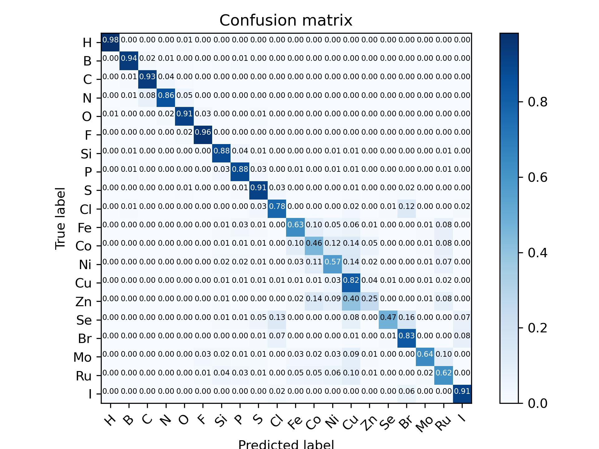

# predictor-for-crystalline-atoms
A predictor for atom types in crystals based on their [k-NN distances](https://en.wikipedia.org/wiki/K-nearest_neighbors_algorithm).
The project proposal could be found in the files.

# 1. The model structure
Current model structure includes a sigmoid classifier, with 3 layers of 64 fully-connected neurons inside, and a weight of 118 applied to the true classes (the classes that presented in the dataset) to resolve class imbalance, and a softmax with input being the combination of the output of the sigmoid classifier and the k-NN distances. The model structure was mainly inspired by  The model is then trained with data obtained through [CSD (Cambridge Structural Database)](https://www.ccdc.cam.ac.uk/solutions/csd-core/components/csd/). 

# 2. Updates
## 2.1 8 Dec 2021
### Current results
Models were trained with k from 1 to 5 based on data of 10 elements in total extracted from the CSD. There is a upper limit of 10,000 samples for each element (otherwise the number of samples is simply the number of occurrences of the element in the database). The performance of the model is shown in form of confusion matrix in the figures below, ordered by k from 1 to 5.

The model seems to have difficulty on distinguishing Aluminium from Lithium, which might be able to be explained chemically. 

### Next steps 
20 elements would be selected from the CSD by abundance, and all pairs of elements that the model make misclassifications would be picked out. In addition, the relationship between the selection of the hyperparameter k and the performance of the model would be investigated.

## 2.2 5 Jan 2022
### Current results
Data of 20 most abundant elements in the CSD were extracted. There were 940k samples in total. The model was trained on k=5 and the result is shown below.

### Next steps
Since there are too much data that would be too slow to fit in the memory, I decided to switch to [tf.data.Dataset](https://www.tensorflow.org/api_docs/python/tf/data/Dataset). Later on, a figure showing how the performance (represented by confusion matrix) is developing with the increase of k shall be plotted. In addition the particular crystal IDs, and the elements where the model made misclassification shall be extracted and analyzed. 

