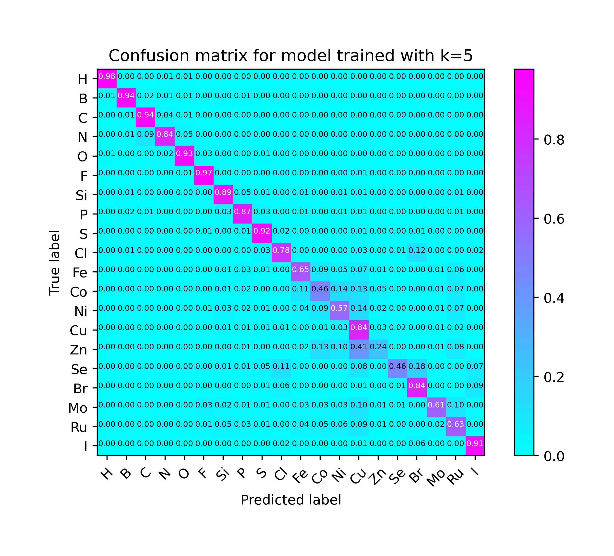
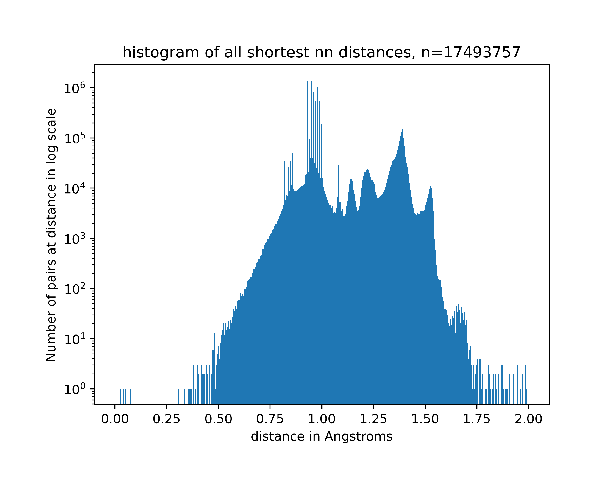
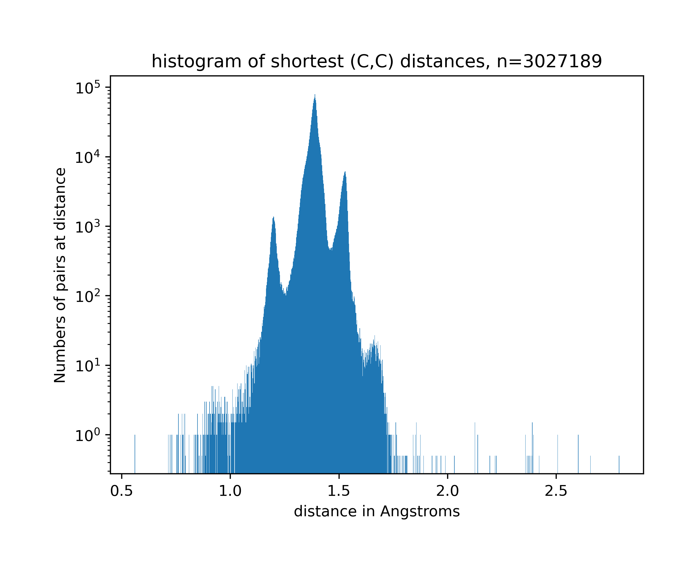

# predictor-for-crystalline-atoms
A predictor for atom types in crystals based on their [k-NN distances](https://en.wikipedia.org/wiki/K-nearest_neighbors_algorithm).
The project proposal could be found in the files.

# 0. Introduction (updated on 15th Apr 2022)

## 0.0 Background Knowledge - Crystals and k-NN distances

Crystals are materials with repetitive atom arrangements in space. Since we only care about inter-atomic distances in this project, crystals are modelled as periodic point sets in 3-dimensional space.

k-NN distances: given a point $p$ in a point set $P$ and a fixed integer $k\ge 1$, k-NN distances is defined as the vector consisting of the increasingly ordered Euclidean distances $d_1\le...\le d_k$ measured from point $p$ to its first k nearest neighbours in the point set P.

## 0.1 Crystal Structure Prediction

Crystal structure prediction is the problem of predicting how molecules will crystalize given only their chemical diagrams, and perhaps, crystallization conditions.  

The current methods for CSP contain two crucial steps:

1. calculate the molecular structures based on chemical diagrams, and then generate possible crystal structures by searching the crystal packing phase space.
2. Evaluate the generated structures, and rank them in order of likelihood.

This machine learning model could serve as a quick filter applied in the second phase, to help narrow down the structures that need to be carefully assessed by suggesting very unlikely structures.

# 1. The model structure
The current model structure includes a sigmoid classifier, with 3 layers of 64 fully-connected neurons inside, and a weight of 118 applied to the true classes (the classes that are presented in the dataset) to resolve class imbalance, and a softmax with input being the combination of the output of the sigmoid classifier and the k-NN distances. The model structure was mainly inspired by [Crystal Structure Prediction via Deep Learning](https://pubs.acs.org/doi/abs/10.1021/jacs.8b03913), especially the idea of resolving class imbalance. The model is then trained with data obtained through [CSD (Cambridge Structural Database)](https://www.ccdc.cam.ac.uk/solutions/csd-core/components/csd/). 

# 2. Updates
## 2.1 8th Dec 2021
### Current results
Models were trained with k from 1 to 5 based on data of 10 elements in total extracted from the CSD. There is an upper limit of 10,000 samples for each element (otherwise the number of samples is simply the number of occurrences of the element in the database). The performance of the model is shown in form of confusion matricesq in the figures below, ordered by k from 1 to 5.

The model seems to have difficulty on distinguishing Aluminium from Lithium, which might be able to be explained chemically. 

### Next steps 
20 elements would be selected from the CSD by abundance, and all pairs of elements that the model make misclassifications would be picked out. In addition, the relationship between the selection of the hyperparameter k and the performance of the model would be investigated.

## 2.2 5th Jan 2022
### Current results
Data of 20 most abundant elements in the CSD were extracted. There were 940k samples in total. The model was trained on k=5 and the result is shown below.

### Next steps
Since there are too much data that would be too slow to fit in the memory, I decided to switch to [tf.data.Dataset](https://www.tensorflow.org/api_docs/python/tf/data/Dataset). Later on, a figure showing how the performance (represented by confusion matrix) is developing with the increase of k shall be plotted. In addition the particular crystal IDs, and the elements where the model made misclassification shall be extracted and analyzed. 

## 2.3 25th Feb 2022

### Current results

The model has been trained on k=1-10. The results can be found in `/results/top20_elements/`

### Next steps

The model appeared to be predictive. 

We got curious about how the distribution of distances between possible pairs of elements being nearest neighbor would be like (e.g. C-C being nearest neighbors, 3 peaks expected in the distribution). This analysis could help explaining the model’s predictive power.

## 2.4 8th Apr 2022

### Current results

**Distribution of nearest neighbour distances by pairs of element types**:

To keep the research simple but not trivial, all atoms with their element types and first nearest neighbour within the types {C, H, O, N} have been extracted. The total number of samples is about 17 millions.

The distribution of the first nearest neighbour distances have been plotted. Then the plot is divided by possible atom type pairs.

Here is the overall distribution of the first nearest neighbour distances: 

Then, these distributions are grouped by pairs of element types (e.g. center atom being Carbon and first nearest neighbour Carbon (C, C) ) and plotted:

It followed our expectation of 3 peaks, as there are 3 valences for C and they have different covalent bond lengths.

Histograms of other element types can be found in the directory `./nn_distribution`.

Then we developed an interest that how many shortest nearest neighbours are actually forming a bond, and if yes, how the distribution of these bond lengths are composed of various bond types? 

We expect that the shortest nearest neighbours are mainly composed of bonds and each bond type would form a peak. In such case, it suggest that the model’s predictive power is based on 

**Extracting bonds from nearest neighbours**

